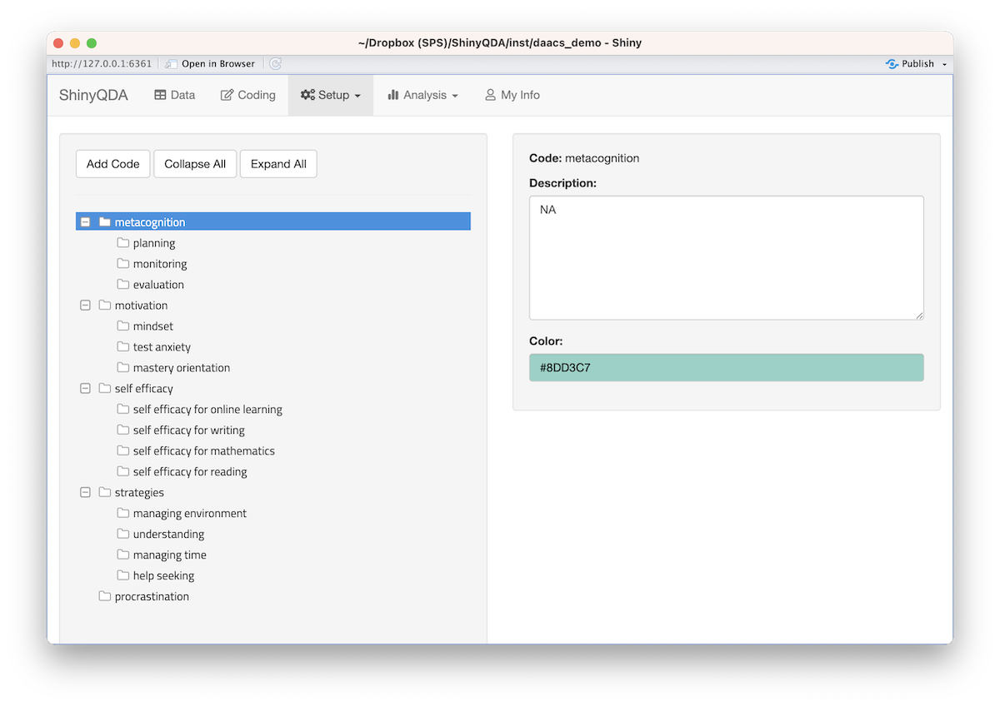
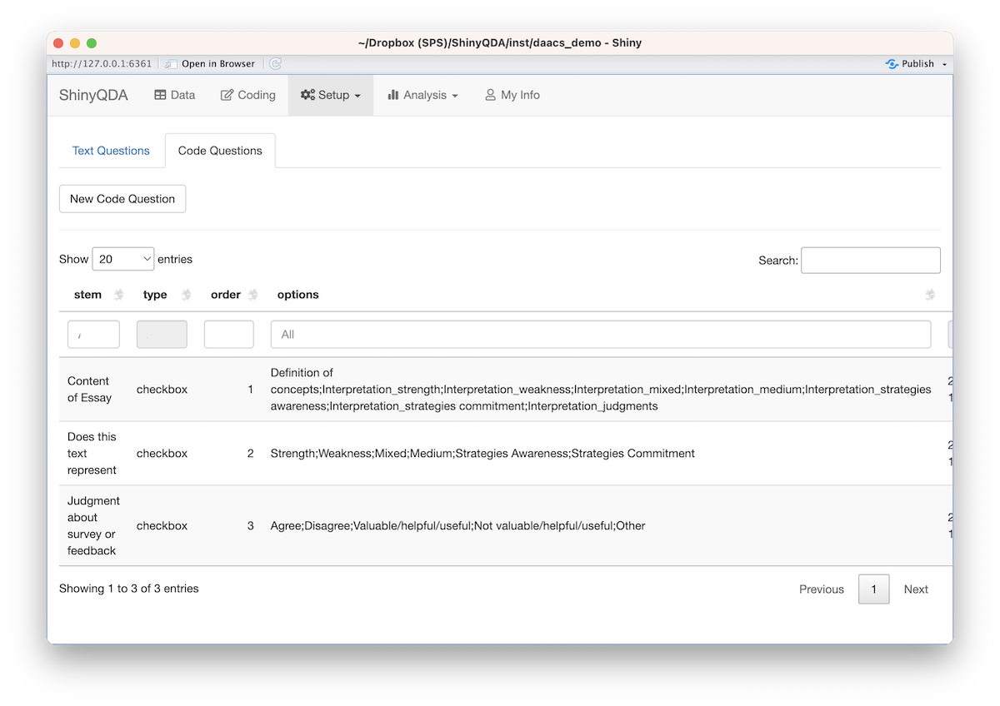
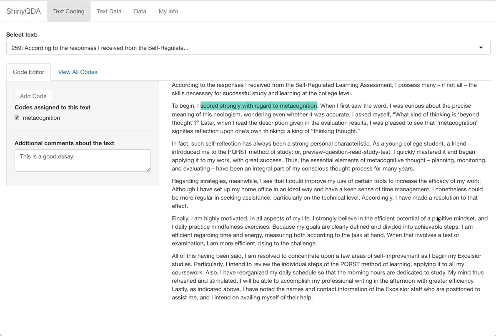

```{r setup, include=FALSE, results='hide', message=FALSE, warning=FALSE, error=FALSE}
library(knitr)
library(rmarkdown)

opts_chunk$set(digits = 3, width = 120)
options(width = 120)

knitr::opts_chunk$set(warning = FALSE, message = FALSE, error = FALSE,
					  fig.width = 12, fig.height=6, fig.align = 'center',
					  digits = 3)
# The following is to fix a DT::datatable issue with Xaringan
# https://github.com/yihui/xaringan/issues/293
options(htmltools.dir.version = FALSE, htmltools.preserve.raw = FALSE)
# This style was adapted from Max Kuhn: https://github.com/rstudio-conf-2020/applied-ml
# And Rstudio::conf 2020: https://github.com/rstudio-conf-2020/slide-templates/tree/master/xaringan
# This slide deck shows a lot of the features of Xaringan: https://www.kirenz.com/slides/xaringan-demo-slides.html

# To use, add this to the slide title:   `r I(hexes(c("DATA606")))`
# It will use images in the images/hex_stickers directory (i.e. the filename is the parameter)
hexes <- function(x) {
	x <- rev(sort(x))
	markup <- function(pkg) glue::glue('')
	res <- purrr::map_chr(x, markup)
	paste0(res, collapse = "")
}
```


class: center, middle, inverse, title-slide

<div style="float: right; width: 40%; top: -50px">
```{r, eval=TRUE, echo=FALSE, out.width='60%', fig.align='right'}

```
</div>

# `r metadata$title`
## `r metadata$subtitle`
### **`r metadata$author`**
### `r metadata$position`
### `r metadata$affiliation`
### `r ifelse(is.null(metadata$date), format(Sys.Date(), '%B %d, %Y'), metadata$date)`


---
# Overview

`ShinQDA` is designed to work with a collection of documents, or texts. It was origianlly designed to help us analyze essays from the [Diagnostic Assessment and Achievement of College Skills (DAACS)](https://daacs.net). For DAACS, students are asked to write a minimum of a 350 word essay where they summarize their self-regulated learning results and identify strategies they will used to be successful students.

.pull-left[
The core data entry features include:

* Selecting parts of the text to tag with codes.
* Provide scafolded questions about the highlighed text.
* Enter codings and comments at the text level (i.e. the entire document).
* Score the text using a pre-defined rubric.
]
.pull-right[
Analysis features include:

* Sentiment analysis both at the individual text level as well as across the entire corpus.
* Tokenization
* Word frequencies
* Code frequencies
* Co-occurrance plots
* Inter-rater reliability
* Topic modeling
]

---
class: inverse, middle, center
# Demo


---
# Creating a new project

You can download `ShinyQDA` from [Github](https://github.com/jbryer/ShinyQDA) using the `remotes` package. Note the addition of the `dependencies` parameter to ensure all the suggested packages are installed too (this includes among other things, the packages to do sentiment analysis).

```{r, eval = FALSE}
remotes::install_github('jbryer/ShinyQDA', dependencies = c('Depends', 'Imports', 'Suggests'))
```

--

We will initialize a new ShinyQDA project using the `daacs_data` included in the package. Change that with your dataset and ensure that `id_column` and `text_column` correspnond to your data frame.

```{r, eval=FALSE}
data("daacs_data", package = 'ShinyQDA')
ShinyQDA::new_app(name = 'daacs_demo', 
				  dir = getwd(),
                  qda_data = daacs_data,
                  id_column = 'id', 
				  text_column = 'qda_text',
                  initialize_sentiment_dictionaries = TRUE,
                  run_app = FALSE)
```

---
# Adding a rubric

Currently rubrics can only be added through the command line. The contents of the rubric (i.e. each cell) can be edited afterwards.

```{r, eval=FALSE}
data("daacs_rubric", package = 'ShinyQDA')
daacs_qda$add_rubric(
	rubric_name = 'daacs',
	description = 'DAACS Scoring Rubric',
	rubric = daacs_rubric)
```

---
class: font90
# The `qda` object

The `ShinyQDA` packages uses a SQLite database to store all the data. You can use any SQLite viewer application to explore (e.g. [DB Browser for SQLite](https://sqlitebrowser.org), [RSQLite](https://rsqlite.r-dbi.org) R package). The Shiny application also has a "raw" view. *However I recommend all interactions (i.e. data read and write) occur through the [`qda`](https://jbryer.github.io/ShinyQDA/reference/qda.html) function.* 

```{r, eval=TRUE}
daacs_qda <- ShinyQDA::qda(paste0(find.package('ShinyQDA'), '/daacs_demo/qda.sqlite'))
ls(daacs_qda)
```

---
# Run the app

You can run the application locally.

```{r, eval=FALSE}
shiny::runApp('daacs_demo')
```

--

Or you can deploy to a Shiny server.

* `ShinyQDA` will not work with [shinyapps.io](https://www.shinyapps.io) since that service will not preserve the data between sessions.

* [DigitalOcean](https://www.digitalocean.com) is a relatively affordable option (the 2GB / 2CPUs tier is usually sufficient and is currently $18 per month). [Click here for installation directions](https://www.digitalocean.com/community/tutorials/how-to-set-up-shiny-server-on-ubuntu-20-04)

* Share using Dropbox (or similar). Be be warned that more than one person working at a time could cause conflicts in the data file.

---
# Setting up the codebook.

Now you can setup the codes by clicking `Setup` -> `Codebook`.

```{r, echo=FALSE}

```

---
# Setting up code questions

.pull-left[
Clicking `Setup` -> `Questions` will allow you to add specific questions (beyond the codes) that can be applied to either the entire text (i.e. each question can be answered once for each text document) or highlighted text.
]
.pull-right[
```{r, echo=FALSE}

```
]

---
# Now you can get coding...

```{r, echo=FALSE}

```

---
# Moving forward...

If you encounter any issues or want to make a feature request you can do so on Github here: https://github.com/jbryer/ShinyQDA/issues

Here are some things I'm working on...

* Increase performance, in particular the topic modeling module.
* Incorporate LLM for summarizing text(s).
* Regression model (for predicting an outcome).
* Ability to add documents in the Shiny application.
* Add/edit rubrics from the Shiny application.


---
class: inverse, middle, center
# Questions?


---
class: inverse, left, middle

```{r login_qrcode, echo=FALSE, out.width='30%', out.height='30%', fig.width=3, fig.height=3, out.extra='style="float:right; padding:10px"; '}
qrcode::qr_code('https://jbryer.github.io/ShinyQDA/') |> plot(col = c('#005DAC', 'white'))
```

.font300[Thank You!]  
[`r icons::fontawesome("envelope") |> icons::icon_style(fill = 'white')` jason.bryer@cuny.edu](mailto:jason.bryer@cuny.edu)  
[`r icons::fontawesome("github") |> icons::icon_style(fill = 'white')` @jbryer](https://github.com/jbryer)  
[`r icons::fontawesome('mastodon') |> icons::icon_style(fill = 'white')` @jbryer@vis.social](https://vis.social/@jbryer)  
[`r icons::fontawesome("link") |> icons::icon_style(fill = 'white')` jbryer.github.io/ShinyQDA/](https://jbryer.github.io/ShinyQDA/)   
[`r icons::fontawesome("linkedin") |> icons::icon_style(fill = 'white')` linkedin.com/in/jasonbryer/](https://www.linkedin.com/in/jasonbryer/)   

