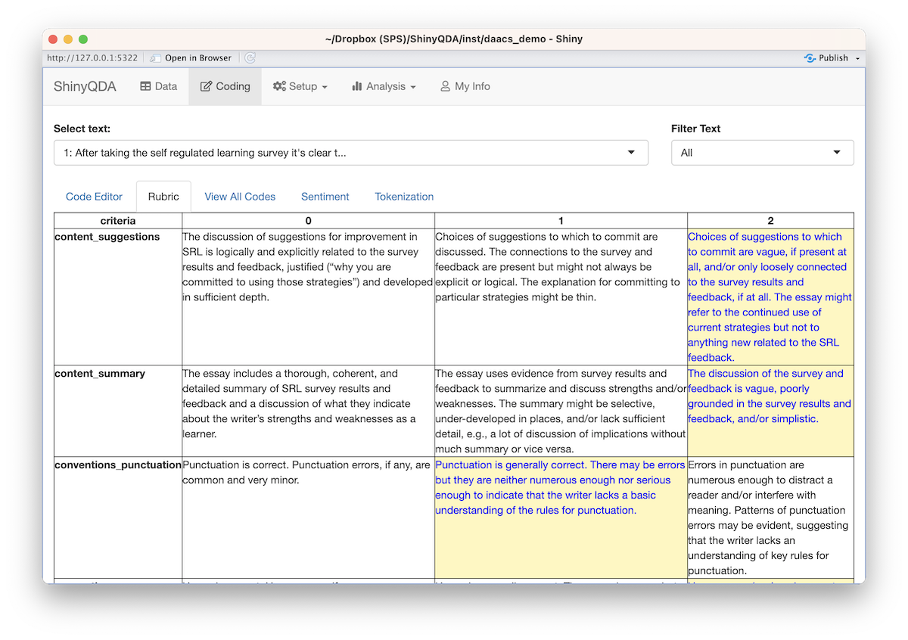
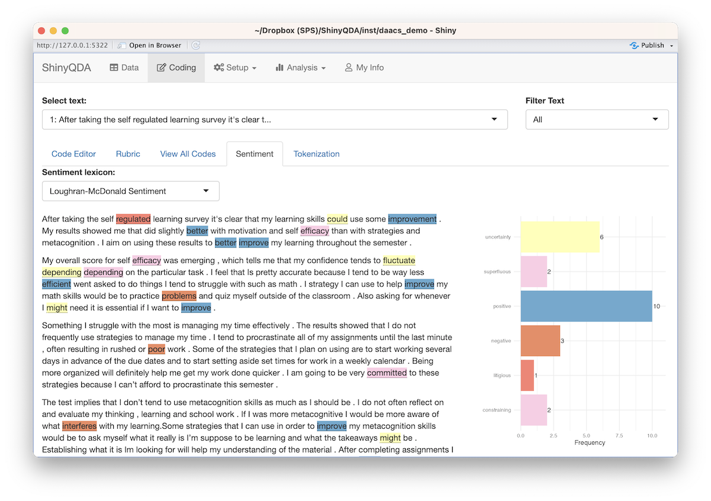
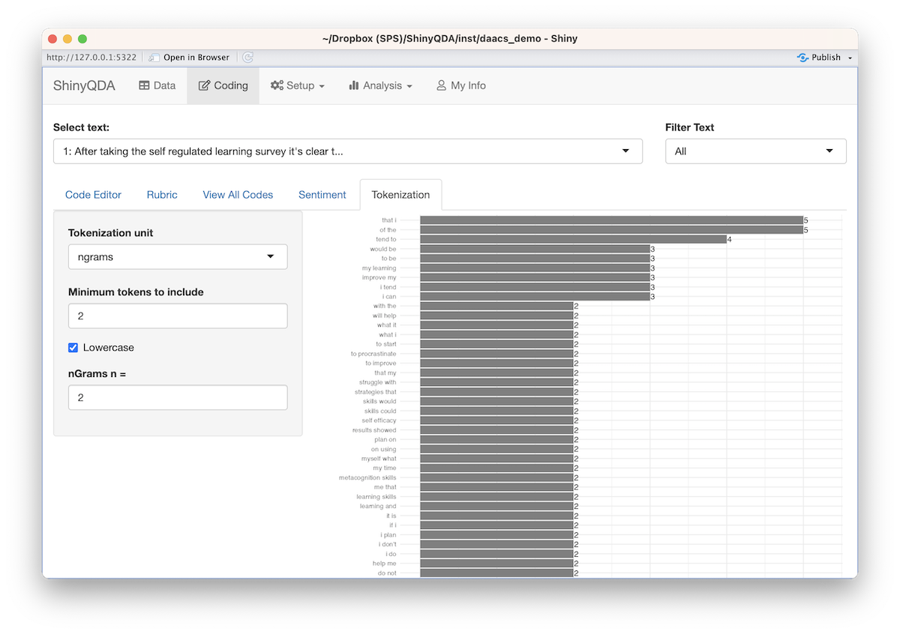
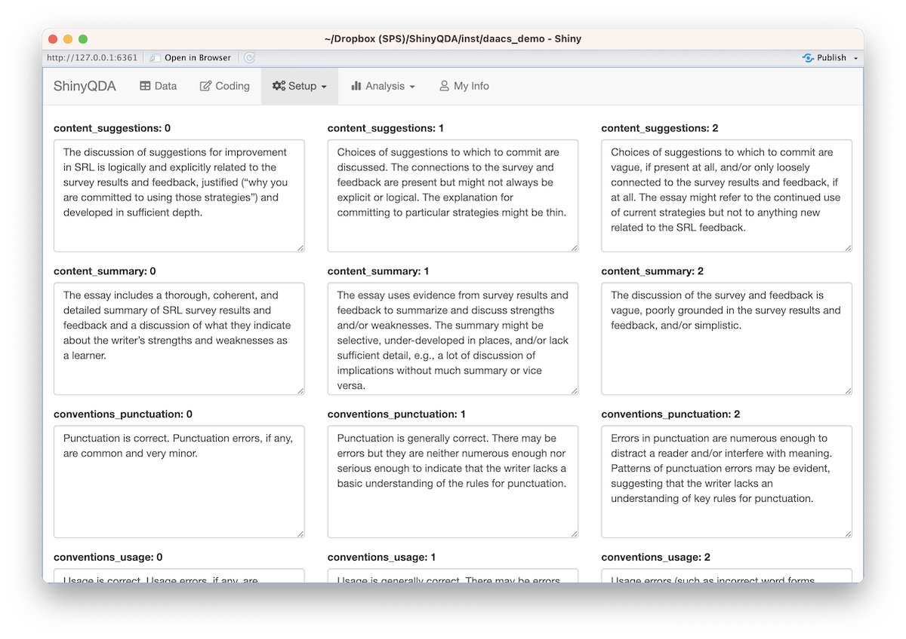
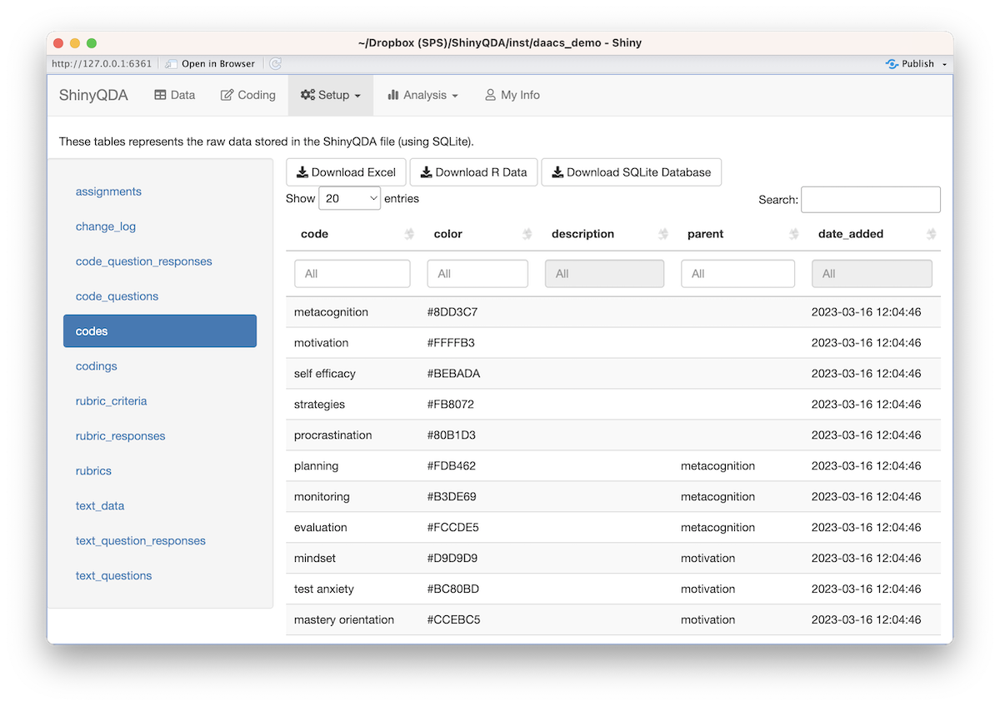
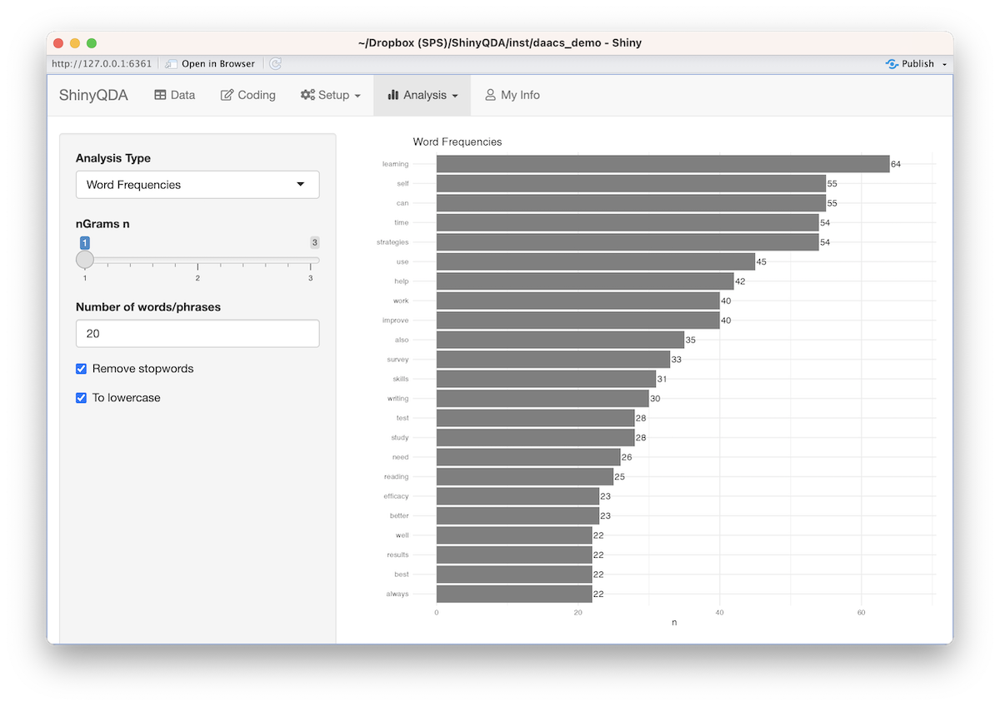
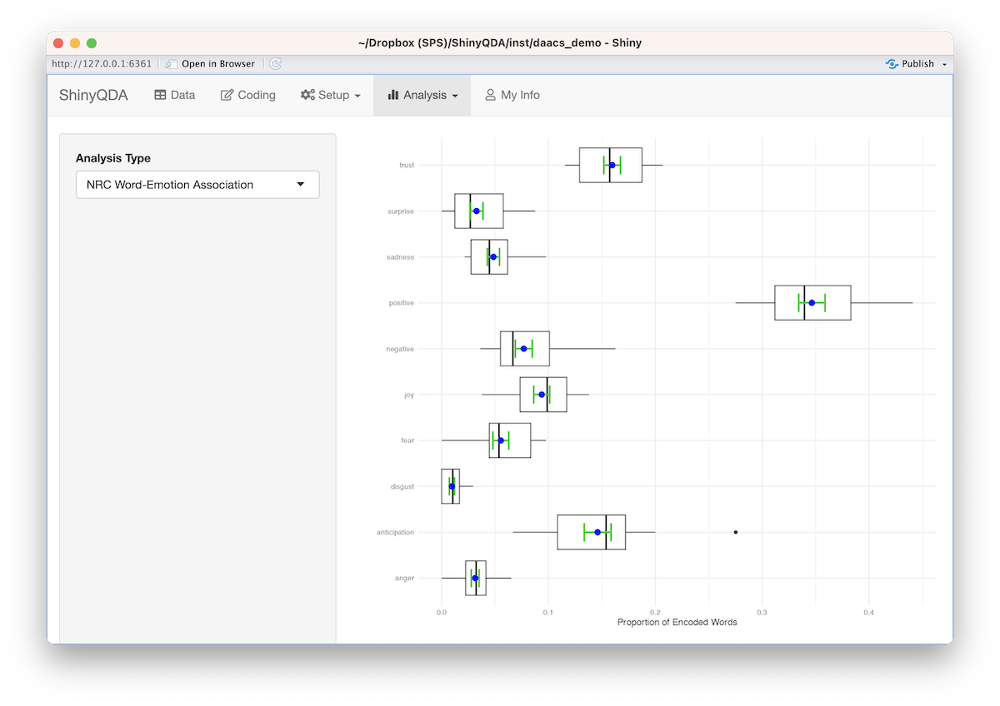
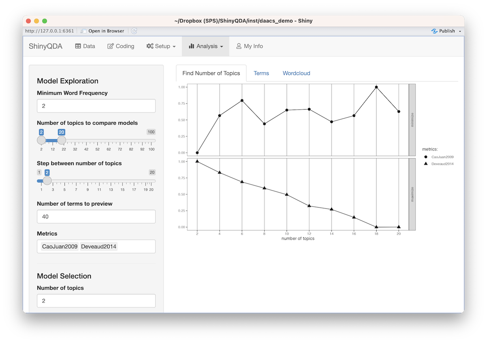

```{r, include = FALSE}
knitr::opts_chunk$set(
  collapse = TRUE,
  comment = "#>"
)
```

This document outlines some of the key features of the ShinyQDA application. 


# Data


```{r, echo = FALSE, fig.alt='Screenshot of data view', out.width='80%', fig.align='center'}
knitr::include_graphics('../man/figures/screenshot_data.png')
```

# Coding

```{r, echo = FALSE, fig.alt='Screenshot of coding panel', out.width='80%', fig.align='center'}
knitr::include_graphics('../man/figures/screenshot_coding.png')
```

```{r, echo = FALSE, fig.alt='Screenshot of dialog box adding a code to a highlighted text', out.width='80%', fig.align='center'}
knitr::include_graphics('../man/figures/screenshot_coding_dialog.png')
```

## Rubric Scoring

```{r, echo = FALSE, fig.alt='Screenshot of rubric scoring', out.width='80%', fig.align='center'}

```


## Sentiment Analysis

```{r, echo = FALSE, fig.alt='Screenshot of sentiment analysis of an individual text document', out.width='80%', fig.align='center'}

```


## Tokenization

```{r, echo = FALSE, fig.alt='Screenshot of tokenization of an individual text docuement', out.width='80%', fig.align='center'}

```


# Setup

## Codebook

```{r, echo = FALSE, fig.alt='Screenshot of the codebook tree', out.width='80%', fig.align='center'}
knitr::include_graphics('../man/figures/screenshot_setup_codebook.png')
```

## Questions


```{r, echo = FALSE, fig.alt='Screenshot of adding text questions', out.width='80%', fig.align='center'}
knitr::include_graphics('../man/figures/screenshot_setup_questions.png')
```


## Rubric

```{r, echo = FALSE, fig.alt='Screenshot of editing rubric criteria', out.width='80%', fig.align='center'}

```

## Raw Data

```{r, echo = FALSE, fig.alt='Screenshot of raw data view', out.width='80%', fig.align='center'}

```


# Analysis

## Descriptive Analysis

```{r, echo = FALSE, fig.alt='Screenshot of word frequency panel', out.width='80%', fig.align='center'}

```


```{r, echo = FALSE, fig.alt='Screenshot of code frequency panel', out.width='80%', fig.align='center'}
knitr::include_graphics('../man/figures/screenshot_analysis_code_frequencies.png')
```

```{r, echo = FALSE, fig.alt='Screenshot of word cloud analysis', out.width='80%', fig.align='center'}
knitr::include_graphics('../man/figures/screenshot_analysis_wordcloud.png')
```


## Sentiment Analysis

```{r, echo = FALSE, fig.alt='Screenshot of sentiment analysis', out.width='80%', fig.align='center'}

```

## Co-Occurance

```{r, echo = FALSE, fig.alt='Screenshot of co-occurance plot', out.width='80%', fig.align='center'}
knitr::include_graphics('../man/figures/screenshot_analysis_cooccurance_plot.png')
```


## Inter-rater Reliability

```{r, echo = FALSE, fig.alt='Screenshot of inter-rater reliability panel', out.width='80%', fig.align='center'}
knitr::include_graphics('../man/figures/screenshot_analysis_interrater_reliability.png')
```


## Topic Modeling


```{r, echo = FALSE, fig.alt='Screenshot of topic modeling', out.width='80%', fig.align='center'}

```

